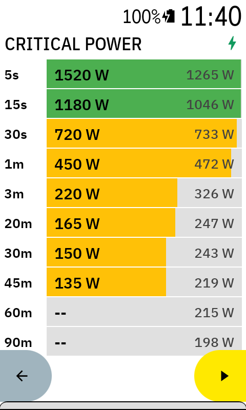
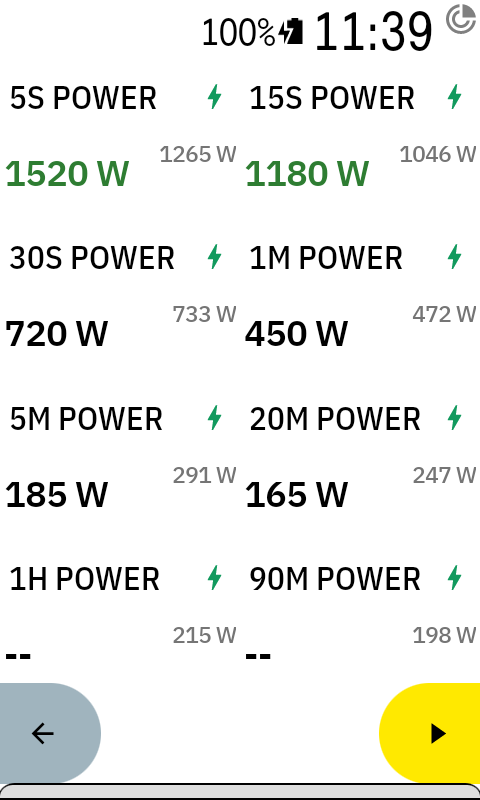

# Karoo Critical Power

> **⚠️ Beta Release** - This extension is in active development. It works well but may have rough edges. Feedback and bug reports welcome via [GitHub Issues](https://github.com/dennisroethig/karoo-critical-power/issues).

A Karoo 3 extension that displays "Critical Power" data fields for specific durations during a ride, with optional comparison to your PRs from intervals.icu.

## Features

- **11 Data Fields** - Track your best average power for: 5s, 15s, 30s, 1m, 3m, 5m, 20m, 30m, 45m, 1h, 1h30m
- **Critical Power Overview** - Visual field showing all durations as horizontal bars comparing current vs PR
- **Real-time Tracking** - See your best power for each duration update live during your ride
- **PR Comparison** - Optional intervals.icu integration shows your PRs for reference (e.g., "285W / 310W")
- **PR Alerts** - Green highlighting when you're matching or beating a PR
- **Offline Support** - PR data is cached, so it works even without connectivity

## Screenshots

| Overview Field | Single Data Field |
|:-:|:-:|
|  |  |

## Requirements

- Karoo 3 device
- Power meter
- (Optional) [intervals.icu](https://intervals.icu) account for PR comparison

## Installation

### Via Companion App (Recommended)

1. **On your phone**, open the [latest release](https://github.com/dennisroethig/karoo-critical-power/releases/latest)
2. **Long-press** the `app-debug.apk` link and select **Share**
3. **Share to the Hammerhead Companion app**
4. **Tap Install** on your Karoo when prompted

That's it! Updates can be installed the same way.

> Requires Karoo 3 with firmware 1.538+ and Companion App 1.36+

### Alternative: Using ADB

```bash
adb install app-debug.apk
```

### Add Data Fields

After installing, add the data fields to your ride profile:

1. On your Karoo, go to **Profiles** > select your profile > **Data Pages**
2. Edit a page and tap a field to change it
3. Look for "Critical Power" fields under the extension category
4. Choose individual durations (e.g., "5s Power", "20m Power") or "Critical Power" for the overview

## Configuration (Optional)

**No configuration needed for basic use!** The extension works out of the box in "Per Ride" mode, comparing your current effort against your best this ride.

To compare against your historical PRs from intervals.icu:

1. **Get your intervals.icu API key:**
   - Log in to [intervals.icu](https://intervals.icu)
   - Go to **Settings** (gear icon) > **Developer Settings**
   - Copy your **API Key**
   - Note your **Athlete ID** (shown in the URL when viewing your calendar, e.g., `i12345`)

2. **Configure the extension:**
   - On your Karoo, find and open the **Critical Power** app
   - Enter your API Key and Athlete ID
   - Choose your comparison mode:
     - **All-time** - Compare against your best ever
     - **90 days** - Compare against recent PRs
     - **42 days** - Compare against very recent PRs
     - **Per Ride** - Compare against your best effort this ride (no intervals.icu needed)
   - Tap "Test Connection" to verify it works

## Building from Source

<details>
<summary>For developers who want to build the APK themselves</summary>

### Prerequisites

- JDK 17+
- Android SDK
- GitHub token with `read:packages` scope for karoo-ext dependency

### Setup

1. Create `~/.gradle/gradle.properties` with your GitHub credentials:
   ```properties
   gpr.user=YOUR_GITHUB_USERNAME
   gpr.key=YOUR_GITHUB_TOKEN
   ```

2. Build the APK:
   ```bash
   ./gradlew assembleDebug
   ```

3. The APK will be at `app/build/outputs/apk/debug/app-debug.apk`

</details>

## Changelog

See [CHANGELOG.md](CHANGELOG.md) for version history.

## License

MIT - see [LICENSE](LICENSE) for details.
